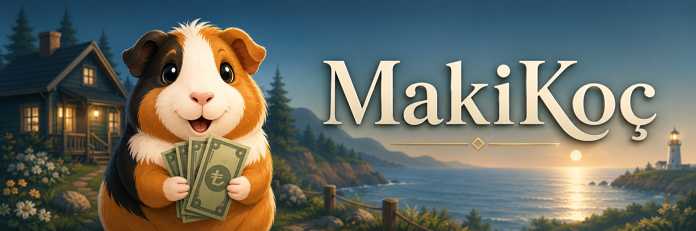
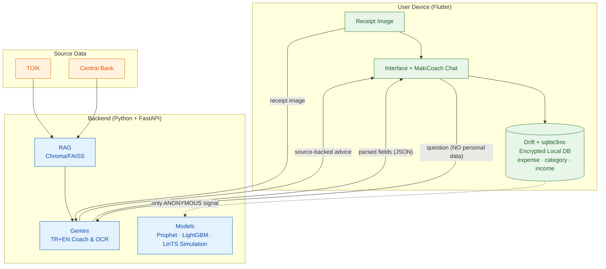
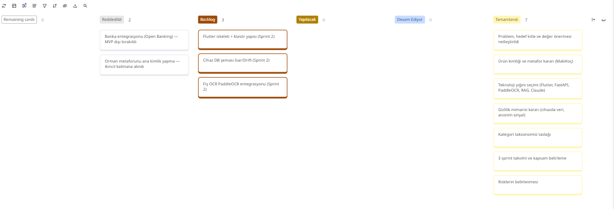

  

# Team Name

**Team 120**

---

## Product Information

### Product Name

**Maki Finance Coach**

### Product Backlog URL

[Team 120 Miro Backlog Board](https://miro.com/welcomeonboard/NXRRV0ovYXp6emtKV0lKWFdyUEZQSjhoNkVVMW5GdTRoVDRXZlNlci9VTXZvUzRwSDRBS2RWWEtRbVFCUE85ak9iQ09xYUhRUXpOR2hyaGdNdHA3a2tXRVlmR2hqbGFXcFp6RWVZemVzeU1iM09aNHA4S2hodllURlBFSEV6Si9nbHpza3F6REdEcmNpNEFOMmJXWXBBPT0hdjE=?share_link_id=239367518026)

### Team Members

- **Emir Hüseyin İnci:** Product Owner & Developer
- **Sevinç Mutlu:** Scrum Master & Developer
- **Shajar Ahmad Ahanger:** Developer

### Product Description

Maki Finance Coach is a privacy-first personal finance application with built-in AI coaching, ensuring all user transaction data remains securely on the user's device. Users enter expenses manually or by scanning receipts (OCR). All personal finance data is stored encrypted locally, and only anonymous signals are sent to the server. The AI coach, Maki, supports its advice with official sources using Retrieval-Augmented Generation (RAG), including data from the Turkish Statistical Institute (TÜİK) and the Central Bank. This allows users to calculate their personal inflation rate and compare it against official Turkish statistics.

### Product Features

- **Data Sovereignty:** All personal financial data remains on the device; only anonymized signals are sent to the server.
- **Receipt OCR:** Automated expense entry by photographing receipts (Gemini Multimodal for direct field extraction).
- **AI Coach (MakiCoach):** TR + EN bilingual, empathetic and non-judgmental, source-backed (RAG) financial coaching.
- **Personal Inflation:** A graph that calculates the user's own inflation and compares it with official TÜİK figures.
- **Expense Forecasting:** Simple spending predictions using Prophet.
- **Soft Gamification:** Daily challenges, XP/level system, badges, and a percentage-based anonymous leaderboard.
- **Light Forest Layer:** Visual progress (sapling/forest growth) to motivate savings—acting as a secondary supporting layer.
- **Smart Notifications:** Personalized notification timing based only on anonymous features using a LinTS Simulation.
- **Debt Simulator (Premium):** Virtual debt relief plan powered by LightGBM.

### Target Audience

- Individuals wanting to track their expenses regularly.
- Privacy-minded users who do not want to send their financial data to the cloud.
- People wanting to measure their financial status against inflation.
- Users wishing to improve their financial literacy and receive coaching support (ages 15-65).
- Users with savings and debt-free targets.

---

## Architecture (Privacy-First)

> Core principle: personal financial data does not leave the device. Only anonymous/identity-free signals are sent to the server.

---

# Sprint 1 — Planning & Project Definition

**Date:** June 19 – July 5 · **Status:** [Completed]

- **Sprint Notes:** This sprint was fully dedicated to planning and project definition; no code was written. Decisions on product vision, target audience, technology stack, product identity (MakiCoach), and privacy architecture were made. Detailed sprint documentation can be found in the [Sprint-1-EN.md](./Sprint-1-EN.md) master file.

- **Estimated points completed in sprint:** 100 Points

- **Points Allocation Logic:** The total project was estimated at ~300 points and divided into 3 sprints (each sprint ~100 points). Since Sprint 1 was planning-heavy, points were distributed according to decision and documentation outputs. Risky tasks (Turkish receipt OCR accuracy, RAG sourcing) were pulled to earlier sprints. Story points were assigned relatively (effort + uncertainty + complexity) using planning poker.

<strong>Sprint 1 — Backlog Arrangement and Story Selection</strong>

| ID | User Story / Task | SP |
|----|--------------------|----|
| US-01 | Clarification of problem, target audience, and value proposition | 8 |
| US-02 | Identity & metaphor decision (MakiCoach + light forest layer) | 8 |
| US-03 | Technology stack selection | 13 |
| US-04 | Privacy architecture decision (data on-device / anonymous signal) | 13 |
| US-05 | Category taxonomy draft | 5 |
| US-06 | 3-sprint schedule + scope definition | 8 |
| US-07 | Risk identification | 5 |

Detailed product backlog: [Product-Backlog-EN.md](./Product-Backlog-EN.md)

- **Daily Scrum:** Since the team is small, Daily Scrums were conducted via short sync meetings + Slack. Meeting notes: [Sprint-1-EN.md#daily-scrum-notes](./Sprint-1-EN.md#daily-scrum-notes)

- **Sprint Board Update:** The sprint board was completed with all planning items moved to the Done column. Remaining items carried over to Sprint 2 are in the Backlog, and rejected decisions are in the Rejected column.

- **Product Status:** As Sprint 1 is a planning sprint, there are no working screens yet. Outputs: clarified product vision, technology & architecture decisions, product identity (MakiCoach), privacy architecture, a 3-sprint roadmap, and a risk list. _(Architecture diagram is shown above.)_

- **Sprint Review:** Product idea, target audience, and value proposition were clearly established. The technology stack was defined in sufficient detail to start development. The privacy-first architecture was approved as the key differentiator of the project. Sprint goals were 100% met without any scope creep. Details: [Sprint-1-EN.md#sprint-review](./Sprint-1-EN.md#sprint-review)

- **Sprint Review Participants:** Emir Hüseyin İnci, Sevinç Mutlu

- **Sprint Retrospective:**
  - Scope was clarified early; technology and identity decisions were made quickly through discussion.
  - Designing the privacy architecture early will reduce surprises in subsequent sprints.
  - Turkish receipt OCR accuracy should be tested early in Sprint 2 with sample receipts.
  - The "first simple working version, then improve" approach for models should be applied disciplinedly.
  - Daily Scrums should be made more structured (fixed time).
  - Details: [Sprint-1-EN.md#sprint-retrospective](./Sprint-1-EN.md#sprint-retrospective)

---

# Sprint 2 — Infrastructure + Receipt OCR + AI Coaching (Beginning)

**Date:** July 6 – 19 · **Status:** [Planned]

- **Sprint Notes:** _(To be filled at the end of the sprint.)_
- **Estimated points completed in sprint:** 100 Points
- **Points Allocation Logic:** Infrastructure & setup, expense management, receipt OCR, and initial AI coaching items were distributed.
- **Daily Scrum:** _(Slack notes to be added.)_
- **Sprint Board Update:** _(Screenshot to be added.)_
- **Product Status:** _(Screenshots to be added.)_
- **Sprint Review:** _(To be added.)_
- **Sprint Retrospective:** _(To be added.)_

---

# Sprint 3 — Inflation, Gamification, Notifications & Premium Setup

**Date:** July 20 – August 2 · **Status:** [Planned]

- **Sprint Notes:** _(To be filled at the end of the sprint.)_
- **Estimated points completed in sprint:** 100 Points
- **Points Allocation Logic:** Personal inflation, gamification, notification optimization, and premium debt simulator items were distributed.
- **Daily Scrum:** _(Slack notes to be added.)_
- **Sprint Board Update:** _(Screenshot to be added.)_
- **Product Status:** _(Screenshots to be added.)_
- **Sprint Review:** _(To be added.)_
- **Sprint Retrospective:** _(To be added.)_
