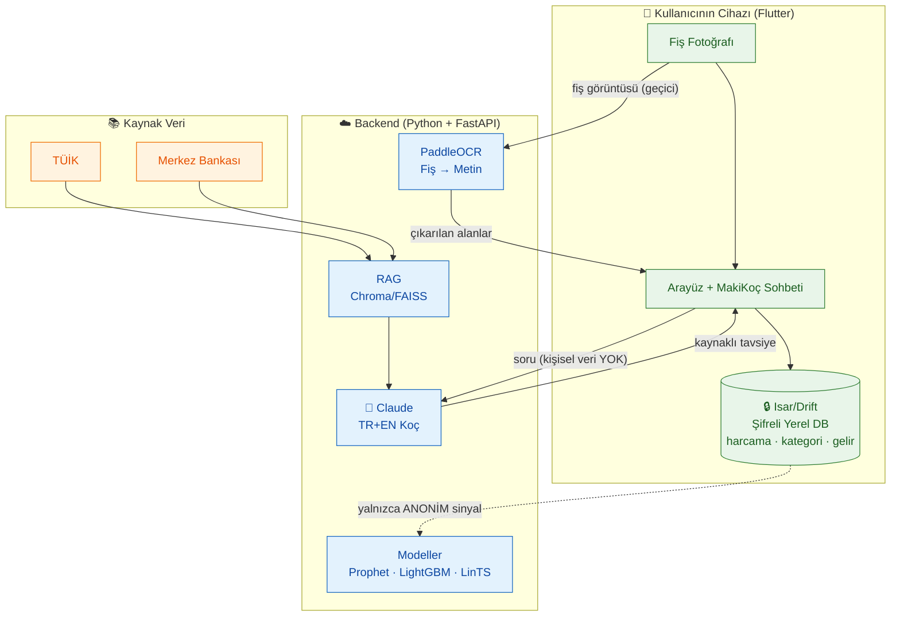

  

# Takım İsmi

**Takım 120**

---

## Ürün İle İlgili Bilgiler

### Ürün İsmi

**Maki Finans Koçu**

### Product Backlog URL

[Takım 120 Miro Backlog Board](https://miro.com/welcomeonboard/NXRRV0ovYXp6emtKV0lKWFdyUEZQSjhoNkVVMW5GdTRoVDRXZlNlci9VTXZvUzRwSDRBS2RWWEtRbVFCUE85ak9iQ09xYUhRUXpOR2hyaGdNdHA3a2tXRVlmR2hqbGFXcFp6RWVZemVzeU1iM09aNHA4S2hodllURlBFSEV6Si9nbHpza3F6REdEcmNpNEFOMmJXWXBBPT0hdjE=?share_link_id=239367518026)

### Takım Elemanları

- **Emir Hüseyin İnci:** Product Owner & Developer
- **Sevinç Mutlu:** Scrum Master & Developer
- **Shajar Ahmad Ahanger:** Developer

### Ürün Açıklaması

Maki Finans Koçu; kullanıcının kendi harcamalarını yönetmesini sağlayan, **gizlilik öncelikli** (veriler kullanıcının cihazında kalır) ve **yapay zeka koçluğu** sunan bir mobil finans uygulamasıdır. Kullanıcı harcamalarını manuel ya da fişini fotoğraflayarak (OCR) girer; tüm kişisel finans verisi cihazda şifreli olarak saklanır, sunucuya yalnızca anonim sinyaller gider. Uygulamanın yapay zeka koçu **Maki**, tavsiyelerini TÜİK ve Merkez Bankası gibi resmî kaynaklarla (RAG) destekler; kullanıcı kendi kişisel enflasyonunu resmî Türkiye rakamıyla karşılaştırabilir.

### Ürün Özellikleri

- **Veri egemenliği:** Tüm kişisel finans verisi cihazda kalır; sunucuya yalnızca anonim sinyaller gider.
- **Fiş OCR:** Market fişini fotoğraflayarak otomatik harcama girişi (PaddleOCR, Türkçe fiş desteği).
- **Yapay zeka koçu (MakiKoç):** TR + EN çift dilli, şefkatli ve yargılamayan, kaynaklı (RAG) finans koçluğu.
- **Kişisel enflasyon:** Kullanıcının kendi enflasyonunu hesaplayıp TÜİK rakamıyla karşılaştıran grafik.
- **Harcama tahmini:** Prophet ile basit harcama öngörüsü.
- **Masum gamification:** Günlük meydan okumalar, XP/seviye sistemi, rozetler, yüzde bazlı kimliksiz leaderboard.
- **Hafif orman katmanı:** Motivasyon için görsel ilerleme (fidan/orman) — ikincil, destekleyici katman.
- **Akıllı bildirimler:** LinTS ile kişiye özel (yalnızca anonim özelliklere dayalı) bildirim optimizasyonu.
- **Borç simülatörü (Premium):** LightGBM tabanlı sanal borçtan çıkma planı.

### Hedef Kitle

- Kendi harcamalarını düzenli takip etmek isteyen bireyler
- Gizliliğine önem veren, verisini buluta göndermek istemeyen kullanıcılar
- Enflasyon karşısında kendi finansal durumunu ölçmek isteyen kişiler
- Finansal okuryazarlığını artırmak ve koçluk desteği almak isteyen kullanıcılar (15–65 yaş)
- Tasarruf ve borçtan çıkma hedefi olan kullanıcılar

---

## 🏗️ Mimari (Gizlilik Öncelikli)

> Temel ilke: **kişisel finans verisi cihazdan çıkmaz.** Sunucuya yalnızca kimliksiz/anonim sinyaller gider.

---

# 🚀 Sprint 1 — Planlama & Proje Belirleme

**Tarih:** 19 Haziran – 5 Temmuz · **Durum:** ✅ Tamamlandı

- **Sprint Notları:** Bu sprint tamamen planlama ve proje belirlemeye ayrıldı; kod yazılmadı. Ürün vizyonu, hedef kitle, teknoloji yığını, ürün kimliği (MakiKoç) ve gizlilik mimarisi kararları verildi. Detaylı sprint dokümanları [Sprint-1 klasöründe](./Sprint-1) yer almaktadır.

- **Sprint içinde tamamlanması tahmin edilen puan:** 100 Puan

- **Puan Tamamlama Mantığı:** Proje toplam ~300 puan olarak tahmin edildi ve 3 sprinte bölündü (her sprint ~100 puan). Sprint 1 planlama ağırlıklı olduğu için puanlar karar ve dokümantasyon çıktılarına göre dağıtıldı. Riskli işler (Türkçe fiş OCR doğruluğu, RAG kaynaklandırma) erken sprintlere çekildi. Story point'ler planning poker ile göreli olarak (efor + belirsizlik + karmaşıklık) verildi.

<strong>Sprint 1 — Backlog düzeni ve Story seçimleri</strong>

| ID | User Story / Görev | SP |
|----|--------------------|----|
| US-01 | Problem, hedef kitle ve değer önermesinin netleştirilmesi | 8 |
| US-02 | Kimlik & metafor kararı (MakiKoç + hafif orman katmanı) | 8 |
| US-03 | Teknoloji yığını seçimi | 13 |
| US-04 | Gizlilik mimarisi kararı (cihazda veri / anonim sinyal) | 13 |
| US-05 | Kategori taksonomisi taslağı | 5 |
| US-06 | 3 sprint takvimi + kapsam belirleme | 8 |
| US-07 | Risklerin belirlenmesi | 5 |

Detaylı ürün backlog'u: [Product-Backlog.md](./Product-Backlog.md)

- **Daily Scrum:** Daily Scrum toplantıları takım küçük olduğu için kısa senkron görüşme + **Slack** üzerinden yürütülmüştür. Toplantı notları: [Daily-Scrum-Notes.md](./Sprint-1/Daily-Scrum-Notes.md)

- **Sprint Board Update:** Sprint board, tüm planlama kalemleri **Tamamlandı** sütununa taşınarak tamamlanmıştır. Sprint 2'ye devreden işler Backlog'da, kapsam dışı bırakılan kararlar Reddedildi sütununda yer almaktadır.

- **Ürün Durumu:** Sprint 1 planlama sprinti olduğu için henüz çalışan ekran yoktur. Çıktılar: netleşmiş ürün vizyonu, teknoloji & mimari kararları, ürün kimliği (MakiKoç) ve gizlilik mimarisi, 3 sprintlik yol haritası ve risk listesi. _(Mimari şeması yukarıda yer almaktadır.)_

- **Sprint Review:** Ürün fikri, hedef kitle ve değer önermesi net biçimde ortaya kondu. Teknoloji yığını, geliştirmeye başlamak için yeterli detayda belirlendi. Gizlilik öncelikli mimari, projenin en kritik farklılaştırıcısı olarak onaylandı. Sprint hedeflerine %100 ulaşıldı, kapsam dışına çıkılmadı. Detay: [Sprint-1-Review.md](./Sprint-1/Sprint-1-Review.md)

- **Sprint Review Katılımcıları:** Emir Hüseyin İnci, Sevinç Mutlu

- **Sprint Retrospective:**
  - Kapsam erken netleşti; teknoloji ve kimlik kararları hızlı ve tartışmayla alındı.
  - Gizlilik mimarisi baştan tasarlandığı için sonraki sprintlerde sürprizi azaltacak.
  - Türkçe fiş OCR doğruluğu Sprint 2 başında birkaç örnek fişle erken test edilmeli.
  - Modeller için "önce basit çalışan sürüm, sonra iyileştir" yaklaşımı disiplinli uygulanmalı.
  - Daily Scrum'lar daha yapılandırılmış (sabit saat) hâle getirilmeli.
  - Detay: [Sprint-1-Retrospective.md](./Sprint-1/Sprint-1-Retrospective.md)

---

# 🚧 Sprint 2 — Temel + Fiş OCR + AI Koçluk (Başlangıç)

**Tarih:** 6 – 19 Temmuz · **Durum:** ⏳ Planlandı

- **Sprint Notları:** _(Sprint sonunda doldurulacak.)_
- **Sprint içinde tamamlanması tahmin edilen puan:** 100 Puan
- **Puan Tamamlama Mantığı:** Temel & altyapı, harcama yönetimi, fiş OCR ve AI koçluk başlangıcı kalemleri dağıtıldı.
- **Daily Scrum:** _(Slack notları eklenecek.)_
- **Sprint Board Update:** _(Ekran görüntüsü eklenecek.)_
- **Ürün Durumu:** _(Ekran görüntüleri eklenecek.)_
- **Sprint Review:** _(Eklenecek.)_
- **Sprint Retrospective:** _(Eklenecek.)_

---

# 🏁 Sprint 3 — Enflasyon, Gamification, Bildirim & Premium İskelesi

**Tarih:** 20 Temmuz – 2 Ağustos · **Durum:** ⏳ Planlandı

- **Sprint Notları:** _(Sprint sonunda doldurulacak.)_
- **Sprint içinde tamamlanması tahmin edilen puan:** 100 Puan
- **Puan Tamamlama Mantığı:** Kişisel enflasyon, gamification, bildirim optimizasyonu ve premium borç simülatörü kalemleri dağıtıldı.
- **Daily Scrum:** _(Slack notları eklenecek.)_
- **Sprint Board Update:** _(Ekran görüntüsü eklenecek.)_
- **Ürün Durumu:** _(Ekran görüntüleri eklenecek.)_
- **Sprint Review:** _(Eklenecek.)_
- **Sprint Retrospective:** _(Eklenecek.)_
