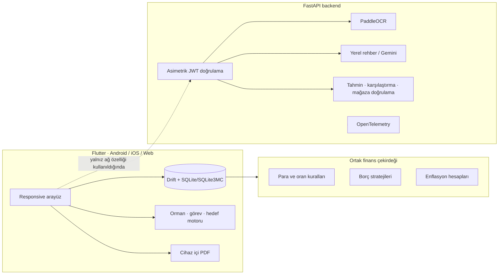

<p align="center">
  
</p>

# Maki Finans Koçu

Maki; gelir, gider, hedef ve borç takibini gizlilik odaklı bir kişisel finans
deneyiminde birleştiren Flutter uygulamasıdır. Finansal davranışlar **Yaşayan Finans
Ormanı** içinde görünür ilerlemeye dönüşür; kullanıcı seçtiği rotaya göre görevler,
öneriler ve analizlerle desteklenir.

**Takım 120** · Product Owner: **Emir Hüseyin İnci** · Scrum Master: **Sevinç Mutlu**
· Developer: **Shajar Ahmad Ahanger**

## Güncel ürün durumu

| Alan | Durum | Açıklama |
|---|---|---|
| Android | Doğrulandı | Debug APK fiziksel cihaza kuruldu. |
| Web | Preview / demo | Yalnız sentetik, oturumluk veriyle çalışır; gerçek finans verisi girişi ve production web derlemesi kapalıdır. |
| iOS | Kod hazır | iOS proje yapısı mevcut; imza ve fiziksel cihaz doğrulaması macOS gerektirir. |
| Flutter kalite | Geçti | `lib` ve `test` fatal analiz hatasız, **178/178 test başarılı**. |
| Backend | Kaynak ve test altyapısı hazır | Canlı kullanım için kimlik, servis anahtarları ve altyapı değerleri dışarıdan sağlanır. |

Son ürün teslimi ve bilinen sınırlar için [DELIVERY.md](./DELIVERY.md), değişiklik özeti
için [CHANGELOG.md](./CHANGELOG.md) dosyasına bakın.

## Maki'yi farklılaştıran deneyim

### Amaca göre dört finans rotası

Onboarding sırasında seçilen amaç yalnızca bir etiket değildir. Ana finans kartını,
önerileri, analiz önceliğini ve günlük orman görevlerini değiştirir:

- **Farkındalık rotası:** harcamaları görünür kılar ve kategori ritmini izler.
- **Hedef rotası:** sürdürülebilir katkı aralığı ve hedefe kalan yolu öne çıkarır.
- **Borç rotası:** ödeme planları ile çığ, kartopu ve özel stratejileri karşılaştırır.
- **Öğrenme rotası:** finansal kavramları kullanıcının kendi bütçesinde açıklar.

### Yaşayan Finans Ormanı

- `Tohum → Fidan → Çalı → Ağaç → Koruluk` büyüme yolu
- Tarihe ve seçilen rotaya göre değişen **325 benzersiz görevlik katalog**
- Her gün üç rota görevi ve bir sürpriz görev
- Takvim tabanlı günlük bakım, seri ve seri koruma yaprakları
- Tohum ekonomisi, orman mağazası ve kalıcı/harcanabilir ürünler
- Mersin Ağacı, Karayemiş Ağacı, Kermes Meşesi, Ilgın ve Funda/Katırtırnağı
  parselleri
- Tam ekran, 30 duraklı görsel hedef haritası ve kilometre taşı ödülleri
- Hedef ödüllerinde tekrar kazanımı engelleyen kalıcı yüksek-su işaretleri

### Gelir, gider ve hedef bağlantısı

- Manuel gelir ve gider ekleme, kategori ve gün bazlı takip
- Haftalık mini takvim, günlük toplamlar ve tam finans takvimi
- Aktif hedef için biriken, kalan, hedef tutarı, ilerleme ve kalan gün görünümü
- İşlem eklerken açık rıza ile **“hedefi etkilesin”** seçeneği
- Varsayılan güvenli davranış: gelir/gider hedefi kendiliğinden değiştirmez
- Bağlanan gelir hedefe eklenir; bağlanan gider mevcut hedef birikiminden düşer
- Silinen bağlı işlemin hedef etkisi de geri alınır

### Akıllı finans araçları

- PaddleOCR ile Türkçe fiş çözümleme ve bulunan toplamı düzenleyip gider olarak ekleme
- Kullanıcının onayladığı fiş kalemleri veya manuel fiyatlarla çalışan yerel Laspeyres
  kişisel enflasyon sepeti; kapsama oranı ve veri yeterliliği görünürdür
- Son 56 günün günlük giderlerinden üretilen yerel, dayanıklı medyan/MAD harcama tahmini;
  yeterli geçmişte backend modeli, ağ hatasında dürüst yerel geri dönüş
- Borç simülatörü, hazır stratejiler ve kullanıcı tarafından oluşturulan özel strateji
- K-anonim, kimliksiz tasarruf karşılaştırması
- Günlük, haftalık veya aylık **cihaz içi PDF** raporu; Android'de güvenli sistem
  “Farklı kaydet” ekranı, web'de doğrudan indirme ve isteğe bağlı paylaşım
- İndirilebilir/paylaşılabilir kişisel enflasyon kartı

### Maki Koç ve bildirimler

- Sürüklenebilen, kenara yaslanan ve ekran oranına göre konumunu hatırlayan Maki balonu
- Anahtar olmadan çalışan yerel rehber
- İsteğe bağlı Gemini anahtarı; yalnızca cihazın güvenli alanında saklanır
- Gizli veriyi hata kayıtlarından temizleyen merkezi hata raporlama sınırı
- Yerel etkileşimlerden öğrenen akıllı zamanlama; kullanıcı arayüzünde debug matrisi yoktur
- Android/iOS işletim sistemi izni, gerçek yerel planlama, bildirim açılma ve anlamlı
  finans davranışı geri bildirimiyle çalışan LinTS zamanlama döngüsü

## Gizlilik sınırı

Maki'nin temel finans kayıtları, hedefleri, ormanı, görevleri, bildirim öğrenimi ve
raporları cihazda tutulur. PDF üretiminde finans verisi sunucuya gönderilmez.
SQLite para alanları kayan nokta olarak değil, `Int64` kuruş birimiyle saklanır; V5→V6
migration mevcut veriyi satır sayısı ve hassasiyet kontrolleriyle kayıpsız taşır.

Web sürümü açıkça bir **preview** yüzeyidir. `WEB_DEMO_MODE=true` olmadan açılmaz,
yalnız sentetik veri kullanır ve in-memory SQLite oturumu sekme kapanınca silinir.

Ağ gerektiren özellikler açıkça ayrılmıştır:

- Kullanıcının seçtiği fiş görseli OCR için yapılandırılmış Maki backend'ine geçici
  işleme amacıyla gönderilir.
- Maki Koç'un çevrimiçi sağlayıcı modu kullanıcı tarafından eklenen API anahtarıyla
  çalışır; yerel rehber her zaman yedektir.
- Premium doğrulaması mağaza ve backend sözleşmelerine bağlıdır.
- Korumalı API uçları kısa ömürlü, asimetrik imzalı dış kimlik belirteci ister.

Depoya gerçek `.env`, erişim belirteci, imzalama anahtarı, servis hesabı veya kullanıcı
verisi eklenmez. Ayrıntılar: [kimlik güvenlik sınırı](./docs/security/identity-boundary.md).

## Mimari


```mermaid
flowchart LR
  subgraph Client["Flutter · Android / iOS / Web"]
    UI["Responsive arayüz"]
    DB[("Drift + SQLite/SQLite3MC")]
    FOREST["Orman · görev · hedef motoru"]
    REPORT["Cihaz içi PDF"]
    UI --> DB
    UI --> FOREST
    UI --> REPORT
  end

  subgraph Core["Ortak finans çekirdeği"]
    MONEY["Para ve oran kuralları"]
    DEBT["Borç stratejileri"]
    INFLATION["Enflasyon hesapları"]
  end

  subgraph API["FastAPI backend"]
    AUTH["Asimetrik JWT doğrulama"]
    OCR["PaddleOCR"]
    COACH["Yerel rehber / Gemini"]
    ML["Tahmin · karşılaştırma · mağaza doğrulama"]
    OTEL["OpenTelemetry"]
  end

  DB --> Core
  UI -. "yalnız ağ özelliği kullanıldığında" .-> AUTH
  AUTH --> OCR
  AUTH --> COACH
  AUTH --> ML
  API --> OTEL
```

## Depo yapısı

```text
.github/                   CI, release ve güvenlik iş akışları
backend/                   FastAPI servisleri, işçiler ve testler
frontend/                  Flutter Android, iOS ve web uygulaması
packages/maki_finance_core Ortak deterministik finans çekirdeği
contracts/                 OpenAPI ve hata sözleşmeleri
design-system/             Maki tasarım sistemi
docs/                      Mimari, güvenlik, işletim ve ürün şartnameleri
infra/                     Compose ve OpenTelemetry tanımları
scripts/                   Kurulum, çalıştırma ve kalite kapıları
security/                  Semgrep ve Trivy politikaları
Sprint-1/ · Sprint-2/ · Sprint-3/  Scrum kayıtları
```

## Hızlı başlangıç

### Gereksinimler

- Flutter SDK ve Dart (proje SDK sınırı: Dart `^3.9.2`)
- Python `3.12`
- Python bağımlılıkları için `uv`
- Android çalıştırma için Android SDK/ADB
- Tam altyapı doğrulaması için isteğe bağlı Docker, Semgrep ve Trivy

### Flutter uygulaması

```powershell
cd frontend
flutter pub get --enforce-lockfile
flutter gen-l10n
dart run build_runner build
flutter run -d chrome --dart-define=MAKI_ENV=preview --dart-define=WEB_DEMO_MODE=true
```

Android cihazda:

```powershell
adb devices
flutter run -d <cihaz-kimliği>
```

### Backend ve PaddleOCR

```powershell
cd backend
uv sync --all-extras --group dev
cd ..
./scripts/setup_paddle_ocr.ps1
./scripts/start_maki_web.ps1
```

`start_maki_web.ps1` geliştirme için kısa ömürlü imzalı oturum üretir, backend'i
başlatır ve Flutter web'i doğru `BACKEND_URL` ile açar.

Telefonun yerel backend'e erişmesi için:

```powershell
adb reverse tcp:8000 tcp:8000
./scripts/start_maki_local.ps1
```

## Yapılandırma

Flutter değerleri `--dart-define` ile verilir:

| Değer | Amaç |
|---|---|
| `MAKI_ENV` | `development`, `staging` veya `production` |
| `BACKEND_URL` | Maki API adresi |
| `MAKI_ACCESS_TOKEN` | Yalnız geliştirme oturumu |
| `OIDC_ISSUER`, `OIDC_CLIENT_ID`, `OIDC_AUDIENCE`, `OIDC_REDIRECT_URI` | Canlı kimlik sağlayıcısı |
| `BILLING_PRODUCT_ID`, `ENABLE_STORE_BILLING` | Mağaza ürünü ve gerçek satın alma akışı |
| `PRIVACY_URL`, `TERMS_URL` | Yasal metin bağlantıları |
| `SENTRY_DSN` | İsteğe bağlı hata izleme |

Backend değişkenleri için yalnız [backend/.env.example](./backend/.env.example) örnek
alınır. Gerçek değerler sürüm kontrolüne alınmaz.

## Kalite ve güvenlik

Temel Flutter doğrulaması:

```powershell
cd frontend
dart analyze lib test
flutter test
flutter build web --release --dart-define=MAKI_ENV=preview --dart-define=WEB_DEMO_MODE=true
flutter build apk --debug
```

Monorepo kalite kapıları:

```powershell
./scripts/verify.ps1
```

Tam kapı; Ruff, mypy, pytest, bağımlılık denetimi, OpenAPI kontrolü, SBOM, finans
çekirdeği testleri, Flutter analiz/test, Android derleme, Semgrep, Trivy ve konteyner
doğrulamalarını kapsar. Araç veya Docker bulunmayan ortamlarda ilgili kapılar açıkça
raporlanır; başarı varmış gibi gösterilmez.

## Sprint ve ürün belgeleri

- [Product Backlog](./Product-Backlog.md)
- [Sprint 1 özeti](./Sprint-1.md)
- [Sprint 2 özeti](./Sprint-2.md)
- [Sprint 3 özeti](./Sprint-3.md)
- [Mobil tasarım sistemi](./design-system/makiko/TASARIM-SISTEMI.md)
- [Frontend yayın rehberi](./docs/operations/frontend-release.md)
- [GitHub teslim şartnamesi](./docs/superpowers/specs/2026-08-01-sevince-github-teslim-paketi-design.md)
- [Lisans](./LICENSE.md)

## Üretime çıkmadan önce

Kaynak kod ve ürün akışları teslim edilebilir durumdadır; mağaza yayını için şu dış
değerler ayrıca sağlanmalıdır:

- Android release keystore ve Play Console ürün kimlikleri
- Apple signing, provisioning profile ve App Store Connect yapılandırması
- Canlı OIDC sağlayıcısı ve HTTPS backend adresi
- Gizlilik/şartlar sayfalarının yayın URL'leri
- Kullanılacaksa canlı Gemini, Sentry, EVDS ve mağaza doğrulama bilgileri

Bu sınırlar [DELIVERY.md](./DELIVERY.md) içinde teslim kontrol listesi olarak yer alır.
