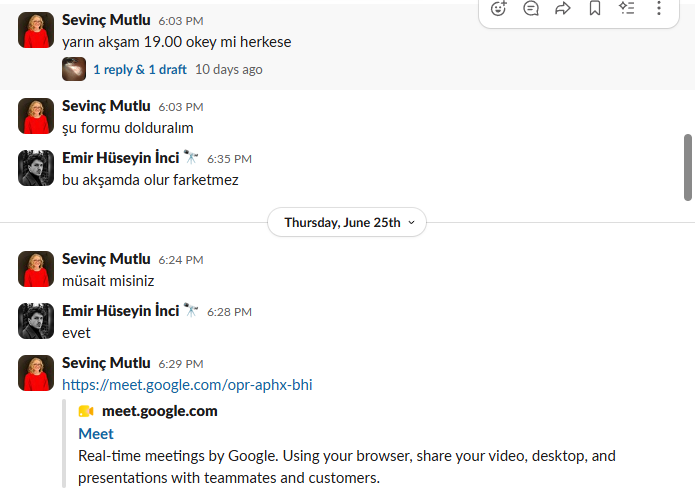

# 🗣️ Sprint 1 — Daily Scrum Notları

**Proje:** Maki Finans Koçu · **Takım:** Takım 120
**Format:** Takım küçük olduğu için Daily Scrum'lar kısa senkron görüşme + **Slack** üzerinden yazışma ile yürütülmüştür.

> Her not: **Dün ne yapıldı? / Bugün ne yapılacak? / Engel var mı?**

Toplantılar Scrum Master (Sevinç Mutlu) tarafından organize edildi. Aşağıda takımın toplantıya davet edildiği örnek bir görüşme yer almaktadır:

---

## 📅 Hafta 1

**Gün 1–2 — Vizyon & Problem**
- Yapıldı: Problem tanımı, hedef kitle ve değer önermesi tartışıldı (US-01).
- Yapılacak: Ürün kimliği ve metafor kararına geçiş.
- Engel: Yok.

**Gün 3–4 — Kimlik & Metafor**
- Yapıldı: MakiKoç ana kimlik olarak seçildi; orman metaforu ikincil/destekleyici katman olarak konumlandırıldı (US-02).
- Yapılacak: Teknoloji yığını araştırması.
- Engel: Orman metaforunun koçluk mesajını gölgelememesi için denge tartışması → karara bağlandı.

**Gün 5 — Teknoloji Araştırması (başlangıç)**
- Yapıldı: Teknoloji araştırması başladı. Bu proje için araştırma süreci oldukça yoğun geçti — mobil framework (Flutter vs. native), cihaz DB (Isar vs. Drift) ve backend (FastAPI) alternatifleri tek tek karşılaştırıldı (US-03).
- Yapılacak: OCR, zaman serisi ve LLM tarafını netleştir.
- Engel: Seçenek çok; her katman için doğru aracı seçmek zaman aldı.

---

## 📅 Hafta 2

**Gün 6–7 — Teknoloji Kararı (tamam)**
- Yapıldı: Teknoloji yığını **özenle** tasarlandı. Her katman gerekçesiyle birlikte seçildi: OCR için Türkçe fiş desteği (PaddleOCR), tahmin için Prophet, kaynaklı koçluk için RAG (Chroma/FAISS) ve çift dilli koçluk için Claude. Yığın netleşti → Flutter + Isar/Drift + FastAPI + PaddleOCR + Prophet + RAG + Claude (US-03 ✅).
- Yapılacak: Gizlilik mimarisi kararı.
- Engel: Yok — araştırmanın yoğunluğu sayesinde karar sağlam zemine oturdu.

**Gün 8–9 — Gizlilik Mimarisi**
- Yapıldı: **Gizlilik uzun uzun konuşuldu** ve projenin en kritik farkı olarak kabul edildi. "Cihazda veri / sunucuya yalnızca anonim sinyal" mimarisi kararlaştırıldı (US-04 ✅). Hangi verinin cihazda kaldığı, neyin anonim gittiği tek tek netleştirildi.
- Yapılacak: Kategori taksonomisi taslağı.
- Engel: Anonim sinyalin gerçekten kimliksiz kalmasını teknik olarak garanti etmek üzerine detaylı tartışıldı; tasarım notu eklendi.

**Gün 10 — Taksonomi & Takvim & Riskler**
- Yapıldı: Kategori taksonomisi taslağı (US-05 ✅), 3 sprint takvimi (US-06 ✅), risk listesi (US-07 ✅).
- Yapılacak: Sprint Review & Retrospective hazırlığı.
- Engel: Yok — sprint hedefine ulaşıldı.

---
