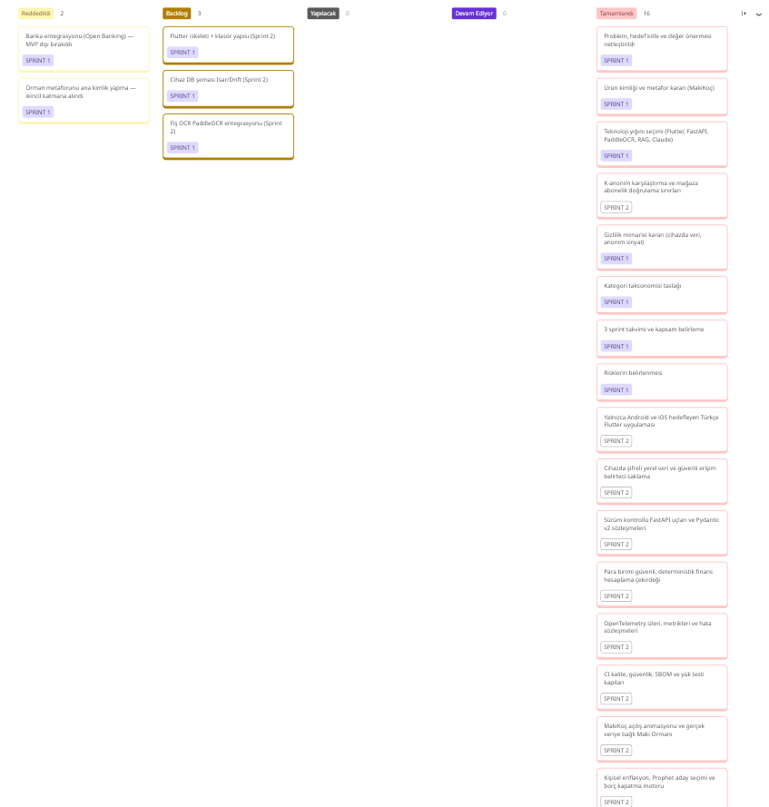
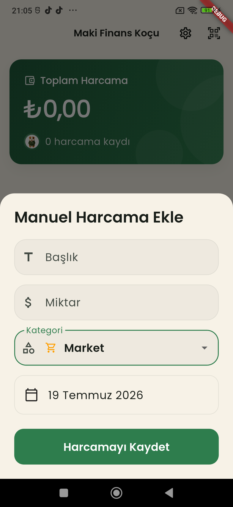
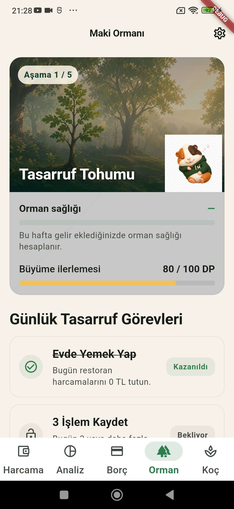

# 🏃 Sprint 2 — Üretim Yeniden Yapılandırması ve Mobil Teslim

**Proje:** Maki Finans Koçu · **Takım:** Takım 120
**Tarih:** 6 – 19 Temmuz · **Durum:** ✅ Tamamlandı

> **Sprint teması:** Sprint 1 ürün kararlarını çalışan, ölçülebilir, güvenli ve fiziksel
> Android cihazda doğrulanmış bir mobil ürüne dönüştürmek.

**Takım:**

- Emir Hüseyin İnci — Product Owner & Developer
- Sevinç Mutlu — Scrum Master & Developer
- Shajar Ahmad Ahanger — Developer

---

## 🎯 Sprint Hedefi

Sevinç'in görsel kararlarını ve MakiKoç kimliğini koruyarak mobil uygulamayı backend
ile uçtan uca bağlamak; finans hesaplamalarını deterministik çekirdeğe taşımak;
Pydantic v2 sözleşmeleri, OpenTelemetry ve otomatik kalite kapılarıyla teslim
edilebilir bir Sprint 2 sürümü oluşturmak.

---

## 📊 Sprint Sonucu

| Ölçüt | Sonuç |
|------|-------|
| Planlanan / tamamlanan | 100 / 100 SP |
| Backend testleri | 193 başarılı, 9 altyapı testi yerelde atlandı |
| Backend kapsamı | %73,29 |
| Finans çekirdeği | 45 test başarılı |
| Flutter | 31 test başarılı |
| Statik denetimler | Ruff, mypy ve Flutter analizi başarılı |
| Android | Debug APK üretildi ve fiziksel cihazda doğrulandı |

Yerelde atlanan 9 test Docker servislerine bağlıdır; aynı sınırlar CI iş akışında
konteynerlerle doğrulanır.

---

## 📋 Sprint Belgeleri

- [Sprint 2 Planlama](./Sprint-2/Sprint-2-Planning.md)
- [Sprint 2 Backlog](./Sprint-2/Sprint-2-Backlog.md)
- [Günlük İlerleme Notları](./Sprint-2/Daily-Scrum-Notes.md)
- [Sprint 2 Review](./Sprint-2/Sprint-2-Review.md)
- [Sprint 2 Retrospective](./Sprint-2/Sprint-2-Retrospective.md)
- [Telefon APK Kanıtı](./docs/evidence/sprint-2-apk.md)

---

## 📱 Ürün Durumu

  
  

Uygulama; harcama kaydı, enflasyon analizi, tahmin, borç planlama, finans koçluğu ve
orman ilerlemesi akışlarını tek Türkçe mobil deneyimde birleştirir.

---

## ✅ Tamamlanma Tanımı

- Kritik akışlar gerçek backend sözleşmelerine bağlıdır.
- Para hesapları kayan noktalı sayı yerine güvenli para türleriyle yapılır.
- Hata, boş ve yükleniyor durumları kullanıcıya Türkçe sunulur.
- OpenTelemetry izleri kişisel finans içeriği taşımadan üretilebilir.
- Mobil, backend ve finans çekirdeği kalite kapılarından geçer.
- Referans APK fiziksel cihazdan alınan parmak iziyle kayıtlıdır.

**Sonuç:** Sprint hedefi karşılandı. ✅
